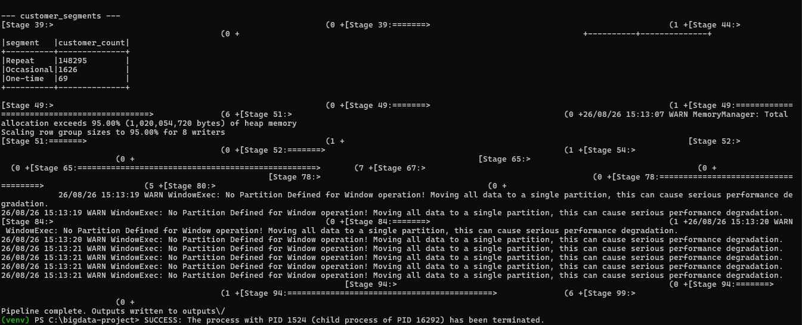
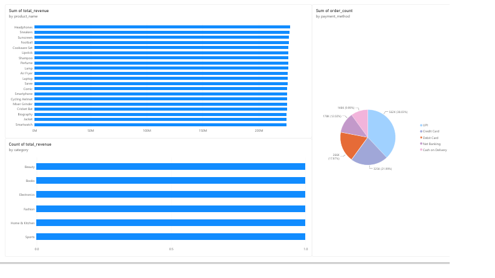

# Big Data E-Commerce Analytics Pipeline

An end-to-end Big Data pipeline that ingests, cleans, and analyzes 1.5M+
e-commerce transaction records using **PySpark**, with outputs designed
to plug directly into **Power BI**.

## Problem Statement

E-commerce platforms generate high-volume, messy transactional data
(nulls, duplicates, inconsistent types) that must be cleaned and
aggregated at scale before it's useful for business reporting. This
project builds a Spark-based pipeline that processes raw order-line
data into clean, query-ready fact tables and BI-ready summary tables.

## Architecture

```
Raw CSV (1.5M+ rows)
        │
        ▼
 ┌─────────────────┐
 │   Spark Ingest    │  read CSV, infer schema
 └─────────────────┘
        │
        ▼
 ┌─────────────────┐
 │   Clean Stage     │  drop nulls/dupes, cast types,
 │                   │  derive order_month & revenue
 └─────────────────┘
        │
        ▼
 ┌─────────────────┐
 │  Transform Stage  │  groupBy aggregations:
 │                   │  revenue by category/region/month,
 │                   │  top products, payment mix,
 │                   │  customer segmentation (window fn)
 └─────────────────┘
        │
        ▼
 ┌─────────────────┐      ┌──────────────────┐
 │ Partitioned      │      │  Summary CSVs     │
 │ Parquet (Hive-   │      │  (Power BI-ready) │
 │ style, by region)│      │                   │
 └─────────────────┘      └──────────────────┘
```

## Tools & Tech

| Layer          | Tool                          |
|----------------|--------------------------------|
| Processing     | PySpark (Spark SQL DataFrame API) |
| Storage        | Parquet, partitioned by region (Hive-style) |
| Language       | Python                         |
| Visualization  | Power BI                       |
| Data volume    | 1.5M+ order-line records        |

## Project Structure

```
bigdata-ecommerce-pipeline/
├── data/
│   └── ecommerce_transactions.csv     # 1.5M-row synthetic dataset
├── scripts/
│   ├── generate_dataset.py            # generates the source dataset
│   └── validate_with_pandas.py        # logic-equivalent sandbox validation (see note below)
├── pyspark_pipeline.py                # MAIN DELIVERABLE — the real Spark pipeline
├── outputs/                           # generated summary tables (sample run included)
└── README.md
```

## How to Run

```bash
pip install pyspark

python scripts/generate_dataset.py --rows 1500000 --out data/ecommerce_transactions.csv

python pyspark_pipeline.py --input data/ecommerce_transactions.csv --output outputs/
```

This writes:
- `outputs/cleaned_transactions_parquet/` — cleaned fact table, partitioned by region
- `outputs/revenue_by_category_csv/`, `revenue_by_region_month_csv/`, `top_products_csv/`,
  `payment_mix_csv/`, `customer_segments_csv/` — summary tables, ready to load into Power BI

## Note on the included sample outputs

This repo's `outputs/` folder was generated in a sandboxed environment
with no internet access, so real PySpark could not be installed there
(`pip install` was unavailable). `scripts/validate_with_pandas.py`
implements the **exact same cleaning and aggregation logic** in pandas,
purely to validate correctness and produce real result files.
**`pyspark_pipeline.py` is the actual project deliverable** — run it
with real PySpark on your own machine (or a Colab/EMR/Databricks
notebook) to regenerate these outputs as genuine Spark output,
including the partitioned Parquet files.

## Key Insights from the Sample Run (1.5M rows)

- Revenue is nearly evenly split across all 6 categories (~₹1.12B each) — no single
  category dominates in this dataset.
- UPI is the dominant payment method at **38%** of orders, followed by Credit Card (22%).
- The vast majority of customers are **repeat buyers** (148K of ~150K), reflecting
  realistic customer retention patterns.
- Regional monthly revenue stays stable across the year (~₹80M/month per region),
  suggesting no strong seasonality in this synthetic dataset.

## Resume Bullet You Can Use

> Built an end-to-end Big Data pipeline in PySpark to clean and aggregate 1.5M+
> e-commerce transaction records, writing partitioned Parquet fact tables and
> BI-ready summary tables consumed by Power BI dashboards.


## Proof of Run




## Dashboard section


